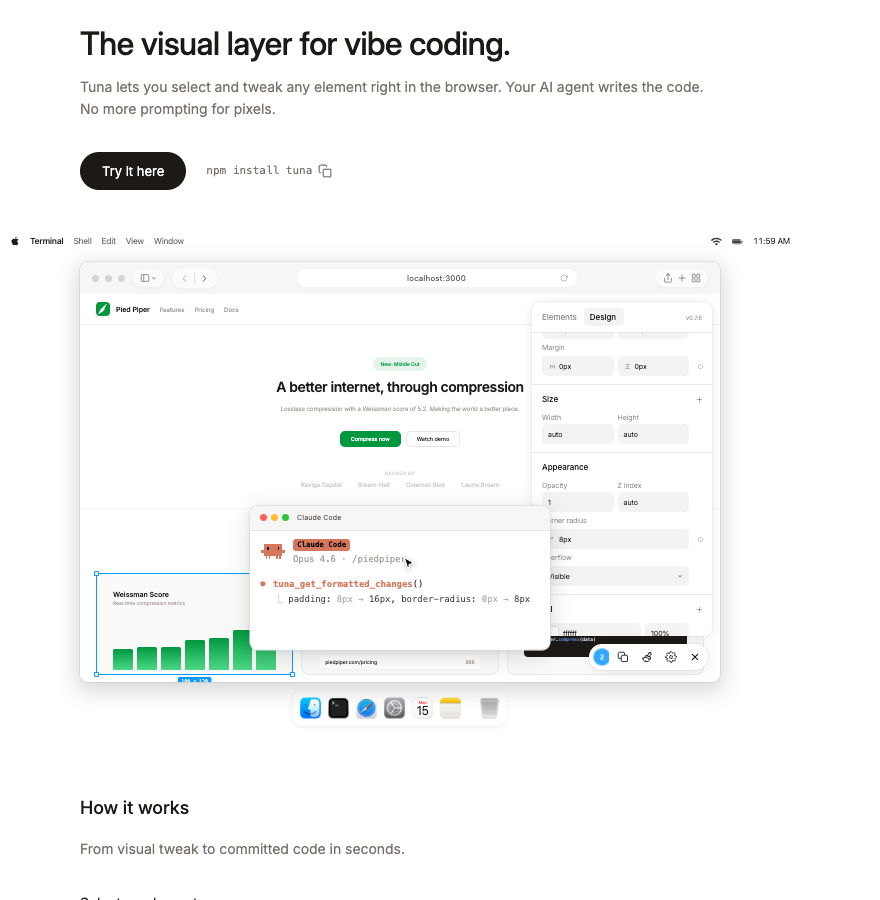
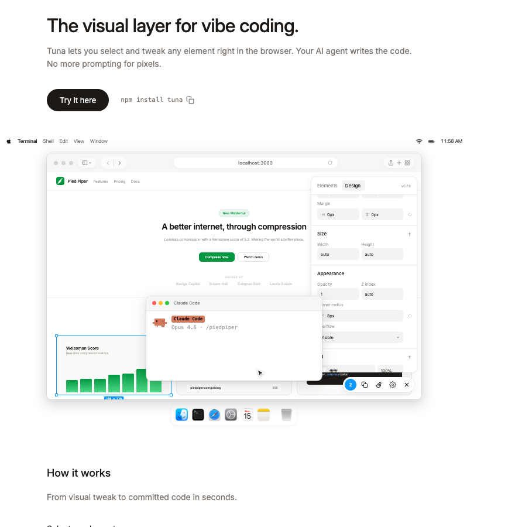

# Tuna

The visual layer for vibe coding.

Select, tweak, restructure — directly in your running app. Your AI agent writes the changes to source. No more prompting for pixels.





## Quick Start

```bash
npm install @suryanewa/tuna
```

Add the overlay to your app layout — it only renders in development by default:

```tsx
import { Tuna } from "@suryanewa/tuna";

export default function Layout({ children }) {
  return (
    <html>
      <body>
        {children}
        <Tuna />
      </body>
    </html>
  );
}
```

**Vite / Astro / SvelteKit:** These frameworks use `import.meta.env.DEV` instead of `process.env.NODE_ENV`. Tuna detects both automatically since v0.7.2. If your dev check fails, use the `force` prop:

```tsx
<Tuna force />
```

Press **Alt+D** (or **Option+D** on macOS) to toggle edit mode, then click any element to start tweaking.

### Chrome Extension

This monorepo also includes a private Manifest V3 Chrome extension package for opening Tuna on arbitrary webpages without adding `<Tuna />` to the page source.

```bash
npm run build:extension
```

Load `packages/chrome-extension/dist` from `chrome://extensions` with Developer Mode enabled, then click the Tuna extension action on any `http`, `https`, or `file` page. Copy-to-clipboard output and MCP handoff use the same overlay implementation and the same local `ws://127.0.0.1:9223/ws` bridge as the React package.

Run the MCP server as usual when you want agent handoff:

```bash
npx @suryanewa/tuna
```

### Monorepo Setup

Run `npx @suryanewa/tuna setup` from your **repo root**. It detects common app directories (`app/`, `client/`, `web/`, `packages/app`) by looking for framework config files (next.config, vite.config) and places `tuna.manifest.json` in the correct `public/` folder. If your app directory isn't detected, run setup from within the app directory instead.

## How It Works

1. **Select** — Click any element in your app to inspect it
2. **Edit** — Adjust styles, reorder elements, edit text, delete, resize, and more
3. **Apply** — Changes are sent to your AI coding tool via MCP to persist in source code

Changes preview instantly in the browser, then get written to your actual source files.

## Features

### Direct Manipulation

- **Drag to reorder** — Drag elements to reorder among siblings. Live sibling shifting shows where the element will land. Works on flex, grid, and block layouts.
- **Drag to reparent** — Drag elements outside their parent to move them into a different container. Visual drop indicator shows the insertion point.
- **Resize by dragging** — Drag edges or corners to resize elements.
- **Reposition** — Drag absolute/fixed elements to move them. Snap guides show alignment with parent edges, centers, and siblings.
- **Inline text editing** — Double-click to edit text content. Enter for line breaks, click outside to save.
- **Delete elements** — Delete or Backspace removes the selected element.
- **Arrow key reorder** — Up/Down/Left/Right to reorder siblings within their container.

### Visual Feedback

- **Sibling outlines** — Hover a parent of the selected element to see dotted outlines on all siblings, revealing the layout structure.
- **Spacing measurements** — Hold Alt/Option while hovering to see distances between elements.
- **Snap guides** — Alignment lines with markers appear when repositioning or resizing near edges, centers, or sibling boundaries.
- **Selection badge** — Shows element dimensions below the selection box.
- **Parent indicator** — Dotted outline on the parent when a child is selected.

### Property Controls

Controls appear based on the selected element:

| Element type | Controls |
|---|---|
| Any element | padding, margin, border-radius, background, opacity, shadow, filters |
| Text | font-size, weight, line-height, letter-spacing, color, alignment, font family |
| Flex container | direction, gap, align, justify, wrap |
| Grid container | columns, rows, gap |
| Image | object-fit, object-position, alt text, loading (lazy/eager) |
| Video | object-fit, autoplay, loop, muted, controls |
| SVG shapes | fill, stroke color, stroke width |
| Positioned | position offsets, z-index |
| Background image | background-size, position, repeat |

### Component Props & State

View and edit React component props and state hooks directly in the panel. Enum props show as dropdowns, booleans as toggle controls. When a manifest is present, state hooks display with their actual variable names and enum values.

### Comments

Annotate elements (click) or areas (drag) with text notes. Comment markers follow scroll, expand on hover with a text preview. Comments are included in the output so your AI agent can address them alongside visual changes.

The comment popover uses a Lexical editor with inline mention tokens inside the overlay's Shadow DOM. Documentation:

- [Overlay Comment Mode: Session Postmortem](../../docs/overlay-comment-mode-postmortem.md) — full issue history (code quality, mention reinsert, mixed element/drawing sync, dashed outline suppression)
- [Comment Editor: Lexical + Shadow DOM](../../docs/comment-editor-lexical-shadow-dom.md) — Lexical-specific pitfalls, fixes, and regression test matrix

### Manifest System (v2)

Generate a `tuna.manifest.json` to describe your design system's components, props, state hooks, and tokens. The manifest powers accurate token pickers, component variant controls, scope pill labels, and richer output context for your AI agent.

**v2 features:**
- **Smart prop filtering** — non-manifest components auto-filter to show only designer-relevant props. Framework plumbing components are hidden entirely.
- **Conditional visibility** — props can declare `"hidden_unless"` to only show when relevant.
- **Variable picker cleanup** — class-only tokens excluded from the variable picker. Only CSS custom properties show.

Generate via the in-app banner prompt, MCP nudge, or `npx @suryanewa/tuna setup`. Existing v1 manifests trigger a regeneration nudge.

### Aspect Ratio Lock

Lock toggle in the Size section constrains proportions when editing width or height. Images and video lock by default during resize (hold Shift to unlock).

### Trigger Editing

Toggle between Hover, Focus, and Active states to inspect and edit styles that only apply in those interaction states.

### Scope Targeting

When you select an element with multiple classes, Tuna shows scope levels so you can choose how broadly your changes apply — from the base class (all buttons) to a variant (ghost buttons) to "This instance". When a manifest is present, variant classes are labeled accurately using the manifest's prop values.

### Design Token Resolution

When you change a value, Tuna finds matching design tokens (CSS variables, utility classes, semantic tokens) and suggests the best match. When a manifest is present, manifest tokens replace the runtime scanner for more accurate results with proper categorization.

### Elements Tab

Figma-style tree view with layout-aware icons (flex-row, flex-column, grid, block, text, image, component). SVG shapes render as mini path previews. Text elements show content preview as the layer name. Drag to reorder or reparent. Selecting an element highlights its descendants.

### More

- **Scrub-to-adjust** — Click and drag on numeric values. Shift for 10x, Alt for 0.1x.
- **Dark mode** — Full dark mode for the overlay. Toggle in Settings or follow system preference.
- **Styling approach detection** — Detects Tailwind, CSS Modules, plain CSS to help your AI agent write changes in the right format.

### Keyboard Shortcuts

| Action | Mac | Windows |
|---|---|---|
| Toggle edit mode | ⌥D | Alt+D |
| Undo | ⌘Z | Ctrl+Z |
| Redo | ⌘⇧Z | Ctrl+Shift+Z |
| Select child | Enter | Enter |
| Select parent | ⇧Enter | Shift+Enter |
| Next sibling | Tab | Tab |
| Previous sibling | ⇧Tab | Shift+Tab |
| Reorder | ↑↓←→ | ↑↓←→ |
| Delete | ⌫ | Delete |
| Measure spacing | ⌥+Hover | Alt+Hover |

## Setup

Auto-configure MCP, install the AI skill, and extract design tokens:

```bash
npx @suryanewa/tuna setup
```

This detects Claude Code and Cursor, configures the MCP server, installs the skill, and generates a partial manifest with your project's design tokens from CSS files. The output prompts your AI agent to complete the manifest with component definitions.

## AI Integration (MCP Server)

Tuna includes a built-in MCP server. Configure your AI tool to use it:

```json
{
  "mcpServers": {
    "tuna": {
      "command": "npx",
      "args": ["-y", "@suryanewa/tuna"]
    }
  }
}
```

### MCP Tools

| Tool | Description |
|---|---|
| `tuna_get_visual_context` | Get the current visual prompt context: selected elements, multi-selection, drawing annotations, comments, pending changes, viewport state, and a DOM spatial page-state snapshot |
| `tuna_get_selection` | Get the currently selected element with its selector, component tree, and styles |
| `tuna_get_pending_changes` | Get all visual changes as before/after diffs |
| `tuna_get_formatted_changes` | Get changes as structured markdown, ready to apply to code, including page-state snapshot context when available |
| `tuna_watch_changes` | Wait for new changes (blocks up to 30s) |
| `tuna_clear_changes` | Clear pending changes after applying them |
| `tuna_get_comments` | Get all comments/annotations left by the user |
| `tuna_manifest_loaded` | Notify the overlay after generating or updating the manifest |
| `tuna_status` | Check overlay connection status |

## Configuration

```tsx
<Tuna
  port={9223}              // WebSocket port for MCP bridge
  hotkey="alt+d"           // Toggle hotkey
  fidelity="standard"      // Output detail: "minimal" | "standard" | "full"
  position="bottom-right"  // Toolbar position
  force                    // Show in production (default: false)
  defaultOpen              // Open toolbar immediately on mount (default: false)
  loadRemoteFonts={false}  // Disable remote Inter stylesheet injection
/>
```

## Element Identification

Tuna uses layered identification to help AI agents find elements in your code:

1. **DOM-level** — CSS selector, text content, classes, computed styles
2. **React-specific** — Component name, props, component ancestry (via fiber tree)
3. **Source-level** — File path + line number (optional, via `__source` metadata)

## Compatibility

- **Frameworks:** Next.js, Vite, Remix, Astro, SvelteKit
- **Styling:** Tailwind CSS, CSS Modules, plain CSS, any utility-first framework
- **AI tools:** Claude Code and Cursor via MCP, plus clipboard fallback for others
- **Viewport:** Desktop only (hidden below 768px)

## Tech Stack

React, TypeScript, Next.js, and a Manifest V3 extension bundle. The overlay package has two public entry points:

- `import { Tuna } from "@suryanewa/tuna"` — React overlay component
- `npx @suryanewa/tuna` — MCP server for AI tool integration

## Development

This repository is a private npm workspaces monorepo:

- `packages/overlay` — the published `@suryanewa/tuna` npm package and MCP server
- `packages/chrome-extension` — the private Chrome extension bundle
- `playground` — the [Tuna marketing site](https://github.com/khadgi-sujan/tuna-site), wired to the local overlay

```bash
npm install
npm run dev              # overlay + CSS watch + playground at http://localhost:3001
npm run dev:overlay      # overlay package only (CSS + TypeScript watch)
npm run dev:playground   # playground only (requires overlay watch in another terminal)
npm run build:overlay    # build the npm package
npm run build:extension  # build packages/chrome-extension/dist
npm run build:playground # production-build the playground
npm run typecheck        # typecheck all workspaces that expose typecheck
npm test                 # run all Vitest tests
```

`npm run dev` runs both watchers together. Overlay CSS changes rebuild automatically, and the playground watches the linked `tuna` package for faster hot reload.

## License

[PolyForm Shield 1.0.0](LICENSE)
